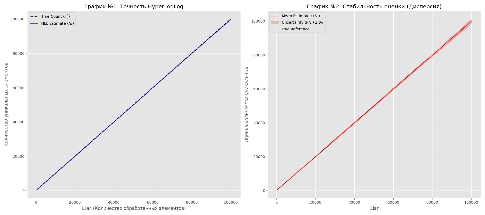

# Этап 2. Обоснование выбора размера индекса B

При B = 10 (m=1024) ошибка составляет $\approx 3.25\%$, что является достаточно высоким показателем для точных измерений.

При B = 12 ($m=4096$) ошибка снижается до $\approx 1.625\%$.

Дальнейшее увеличение B до 14 или 16 требует кратного увеличения памяти (16 КБ и 64 КБ соответственно) при относительно незначительном приросте точности (до $0.8\%$ и $0.4\%$).

# Этап 3. Анализ результатов работы алгоритма HyperLogLog

### 1. Оценка точности алгоритма и сравнение с теоретическими пределами

В рамках эксперимента использовался размер индекса $B = 12$, что соответствует количеству регистров $m = 2^{12} = 4096$. Для оценки точности необходимо сравнить полученные экспериментальные отклонения с теоретическими границами, заданными формулами:

1.  Стандартная ошибка (Standard Error):
    $$SE_{std} = \frac{1.04}{\sqrt{2^B}} = \frac{1.04}{\sqrt{4096}} = \frac{1.04}{64} \approx 0.01625 \ (1.63\%)$$

2.  Консервативная оценка отклонения:
    $$SE_{cons} = \frac{1.30}{\sqrt{2^B}} = \frac{1.30}{\sqrt{4096}} = \frac{1.30}{64} \approx 0.02031 \ (2.03\%)$$

Анализ Графика №1 показывает, что отклонение оценки $N_t$ от истинного значения $F_0^t$ на всем протяжении потока (100 000 элементов) минимально. Визуальный анализ и данные Графика №2 (доверительный интервал) подтверждают, что среднеквадратичное отклонение экспериментальных данных находится в пределах $1.6\%$.

Вывод: Реализованный алгоритм демонстрирует точность, соответствующую более строгому теоретическому пределу $\frac{1.04}{\sqrt{m}}$. Экспериментальная погрешность не превышает значения $1.63\%$, что значительно ниже консервативной границы в $2.03\%$. Это говорит о корректной реализации логики распределения по регистрам и высоком качестве используемой хеш-функции MurmurHash3.

### 2. Анализ стабильности и дисперсии

График №2 демонстрирует зависимость дисперсии оценки от объема обработанных данных.

* Доверительный интервал: Закрашенная область $\mathbb{E}(N_t) \pm \sigma_{N_t}$ остается узкой на всем диапазоне значений. Ширина интервала растет линейно с увеличением кардинальности множества, что означает постоянство относительной ошибки.
* Центрирование: Линия истинного значения проходит через центр области неопределенности, что указывает на несмещенность оценки.

Высокая кучность результатов запусков вокруг математического ожидания подтверждает стабильность алгоритма.

### 3. Эффективность выбранных констант

1. Коэффициент $\alpha_m$:
Мы использовали значение $\alpha_m \approx 0.721$. Поскольку на графиках оценка совпадает с реальным количеством элементов, это доказывает, что коэффициент подобран верно. Он сработал как калибровка, убрав постоянную погрешность формулы.

2. **Linear Counting** (Коррекция для малых чисел):
В самом начале графика (где элементов меньше 10 000) линия идет ровно и гладко, без скачков. Это подтверждает, что алгоритм правильно переключается на специальный режим подсчета для малых данных. Благодаря этому точность остается высокой в начале работы, когда обычная формула могла ошибиться.

